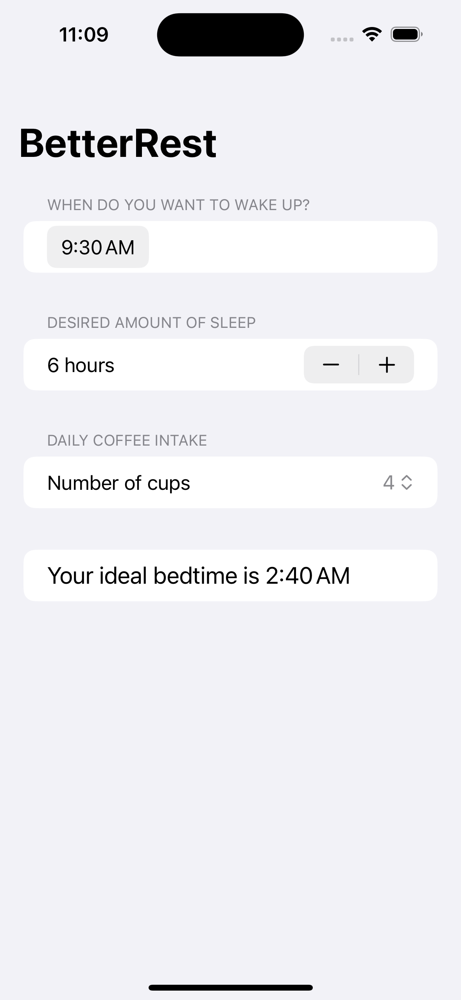

# BetterRest

BetterRest is an insightful iOS app built using SwiftUI that helps users find their optimal bedtime based on their wake-up time, desired sleep duration, and coffee consumption. The app leverages machine learning to provide personalized sleep recommendations, ensuring users can achieve their best rest.

    
    
    

## Features

- **Wake Up Time**: Users can select their desired wake-up time using a user-friendly date picker.
- **Sleep Duration**: Adjust the desired amount of sleep using a stepper, which reflects changes in real-time.
- **Coffee Intake**: Choose the number of coffee cups consumed, which influences the bedtime calculation.
- **Bedtime Prediction**: Utilizes a Core ML model to predict the ideal bedtime based on the user's inputs.

## How to Use

1. Start the app on your iOS device or simulator.
2. Set your desired wake-up time.
3. Adjust the amount of sleep you wish to get.
4. Specify your daily coffee intake.
5. View the calculated optimal bedtime to achieve your desired rest.

## Technologies Used

- **SwiftUI**: For crafting the user interface.
- **Core ML**: Apple's machine learning framework, used here to integrate a predictive model for sleep analysis.
- **Xcode**: The development environment for building iOS applications.

## Getting Started

To explore BetterRest on your own device:

- Install Xcode on your Mac.
- Clone or download the repository.
- Open the project in Xcode.
- Run the app on a simulator or an actual device to test its features.

## Credits

This project is part of the ["100 Days of SwiftUI"](https://www.hackingwithswift.com/100/swiftui) course by Paul Hudson. I learned how to build this project and further develop my SwiftUI skills through the course.

## Learning Experience

Developing BetterRest was an enriching experience, providing a deep dive into SwiftUI's capabilities and the practical application of machine learning in iOS development. Through this project, I've gained insights into how machine learning models can be effectively used to analyze and predict user data, enhancing the app's utility and personalization.

In addition to following the main project instructions, I completed extra challenges provided at the end of the course where there were no instructions.
